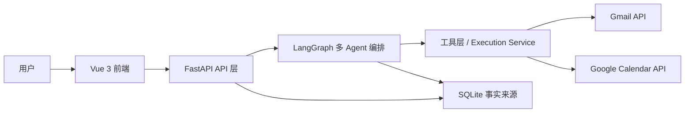
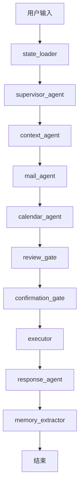
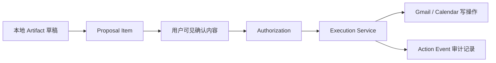

# Mailflow Agent 架构说明

本文档是 CS599 课程提交目录下的架构说明入口。更完整的历史规格、ADR、安全规则和验收矩阵已归档到 `src/project-docs/`，这里保留面向评阅的简明架构视图。

## 系统分层

## Agent 编排

## 安全执行闭环

## 关键设计原则

- AI 可以准备邮件和日程草稿，但不能绕过用户确认直接执行外部写操作。
- SQLite 是 Work Item、Artifact、Proposal、Authorization、Action Event、设置、联系人和记忆的事实来源。
- 上传文件、邮件正文和 LLM 输出都视为不可信上下文，不能覆盖系统安全规则。
- 前端只持有用户可见状态和交互上下文，不保存 OAuth Secret 或 access token。

## 详细文档位置

- Product Spec: `src/project-docs/product_scope.md`
- Architecture Decisions: `src/project-docs/architecture_decisions.md`
- Safety Rules: `src/project-docs/safety_rules.md`
- Acceptance Matrix: `src/project-docs/acceptance_matrix.md`
- Code Guide: `src/project-docs/code_guide.md`
