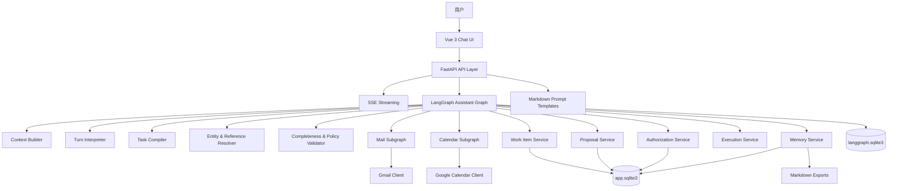
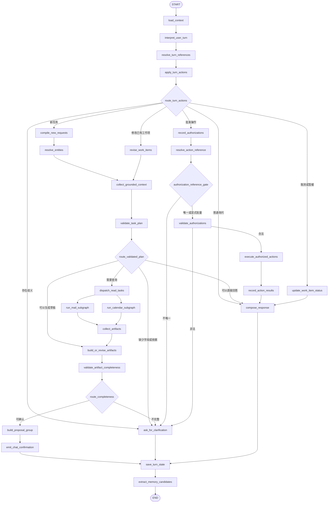
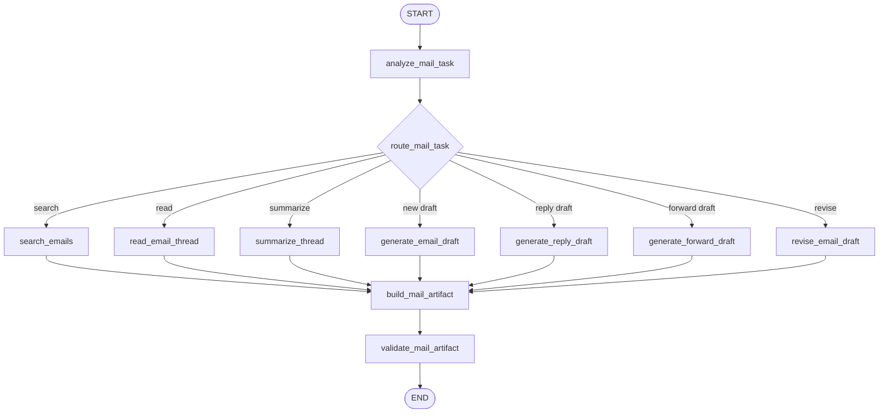
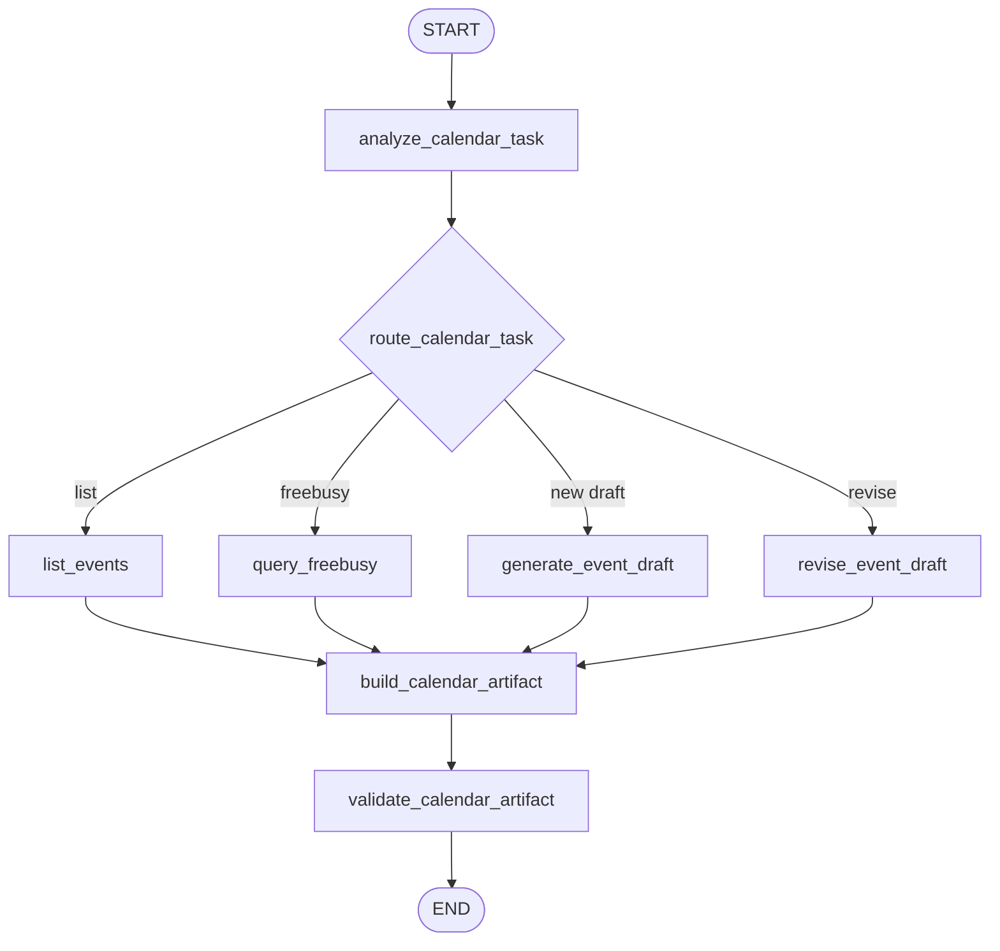

# 基于 LangGraph 与 FastAPI 的多 Agent 邮件与日程助理系统

> 开发实施文档  
> 文档版本：v1.0  
> 编写日期：2026-06-09  
> 技术栈：FastAPI + LangChain + LangGraph + Vue 3 + Gmail API + Google Calendar API  
> MVP 存储：SQLite + Markdown  
> 适用范围：单机开发、单用户或少量测试用户、课程设计 / 毕业设计 / MVP 演示

---

## 目录

1. [项目概述](#1-项目概述)
2. [项目目标](#2-项目目标)
3. [MVP 范围与非目标](#3-mvp-范围与非目标)
4. [核心业务原则](#4-核心业务原则)
5. [总体技术架构](#5-总体技术架构)
6. [LangGraph 编译图设计](#6-langgraph-编译图设计)
7. [主图节点说明](#7-主图节点说明)
8. [邮件子图设计](#8-邮件子图设计)
9. [日程子图设计](#9-日程子图设计)
10. [聊天式确认机制](#10-聊天式确认机制)
11. [工作项、草稿、Proposal 与授权](#11-工作项草稿proposal-与授权)
12. [字段依据与 Provenance](#12-字段依据与-provenance)
13. [邮件完整性规则](#13-邮件完整性规则)
14. [日程完整性规则](#14-日程完整性规则)
15. [多人、多任务与指代解析](#15-多人多任务与指代解析)
16. [短期记忆与长期记忆](#16-短期记忆与长期记忆)
17. [LangGraph State 结构](#17-langgraph-state-结构)
18. [数据库设计](#18-数据库设计)
19. [SQLite 与 Markdown 职责划分](#19-sqlite-与-markdown-职责划分)
20. [后端目录结构](#20-后端目录结构)
21. [前端目录结构](#21-前端目录结构)
22. [API 契约](#22-api-契约)
23. [SSE 事件协议](#23-sse-事件协议)
24. [开发阶段总览](#24-开发阶段总览)
25. [阶段 0：冻结需求与安全规则](#25-阶段-0冻结需求与安全规则)
26. [阶段 1：初始化工程骨架](#26-阶段-1初始化工程骨架)
27. [阶段 2：Google OAuth 与用户配置](#27-阶段-2google-oauth-与用户配置)
28. [阶段 3：字段依据与完整性校验](#28-阶段-3字段依据与完整性校验)
29. [阶段 4：Gmail 能力接入](#29-阶段-4gmail-能力接入)
30. [阶段 5：Google Calendar 能力接入](#30-阶段-5google-calendar-能力接入)
31. [阶段 6：Work Item 与 Proposal 安全闭环](#31-阶段-6work-item-与-proposal-安全闭环)
32. [阶段 7：LangGraph 主图、子图与任务编译](#32-阶段-7langgraph-主图子图与任务编译)
33. [阶段 8：Vue 聊天界面与 SSE](#33-阶段-8vue-聊天界面与-sse)
34. [阶段 9：短期记忆、长期记忆与 Markdown 导出](#34-阶段-9短期记忆长期记忆与-markdown-导出)
35. [阶段 10：测试、安全与可观测性](#35-阶段-10测试安全与可观测性)
36. [阶段 11：MVP 发布验收](#36-阶段-11mvp-发布验收)
37. [端到端验收场景](#37-端到端验收场景)
38. [后续演进路线](#38-后续演进路线)
39. [官方参考资料](#39-官方参考资料)

---

# 1. 项目概述

本项目是一套：

> **基于 LangGraph 与 FastAPI 的多 Agent 邮件与日程助理系统。**

系统通过自然语言聊天完成 Gmail 邮件处理与 Google Calendar 日程管理，并以以下能力为核心：

```text
可理解
可追问
可修改
可确认
可恢复
可追踪
```

用户可以像和助理聊天一样提出请求：

```text
给李明写一封邮件，告诉他项目会延期一天。
```

```text
邮件先不要发。帮我创建一个明天下午三点的项目复盘会议。
```

```text
会议创建后，把会议链接补充到刚才给李明的邮件里。
```

```text
确认发送。
```

系统不能在信息缺失时凭空猜测，也不能在没有明确确认时执行外部写操作。

---

# 2. 项目目标

## 2.1 功能目标

系统需要支持：

- Google OAuth 登录与授权；
- Gmail 搜索；
- Gmail 邮件详情读取；
- Gmail 线程读取；
- 邮件摘要；
- 新邮件草稿；
- 回复邮件草稿；
- 转发邮件草稿；
- 邮件修改；
- 聊天式确认发送；
- Google Calendar 事件查询；
- Google Calendar Freebusy 查询；
- 日程草稿；
- 日程修改；
- 聊天式确认创建日程；
- 多个未完成工作项并存；
- 一句话多人；
- 一句话多任务；
- 指代消解；
- 缺失字段追问；
- 短期记忆；
- 长期偏好；
- SQLite 本地持久化；
- Markdown 可读导出；
- SSE 流式前端反馈。

## 2.2 安全目标

系统必须保证：

```text
关键信息有依据。
无法唯一确定时主动追问。
用户没有明确确认时不执行写操作。
修改草稿后旧授权立即失效。
重复点击不会重复发送或重复创建日程。
```

## 2.3 工程目标

第一版以轻量 MVP 为主：

```text
FastAPI
LangChain
LangGraph
Vue 3
SQLite
Markdown
Gmail API
Google Calendar API
```

暂时不使用：

```text
Redis
PostgreSQL
Celery
Kafka
向量数据库
后台自动任务
多级企业审批
```

## 2.4 代码注释要求

本项目生成和维护的代码必须保持较高注释密度，尤其是后端服务边界、状态转换、安全校验、外部 API 调用、数据库迁移、前端交互状态等位置。

注释目标：

```text
解释为什么这样设计；
说明当前代码在整体工作流中的位置；
标出安全边界和不可绕过的规则；
说明未来阶段会接入的模块；
帮助后续开发者快速理解上下文。
```

注释要求：

- 新增模块、类、函数应有说明其职责的注释或 docstring；
- 涉及 OAuth、Token、LLM、Google API、Proposal、Authorization、Execution、File Parsing、Selected Context 的代码必须写清楚边界；
- 数据库迁移要说明表的业务用途，而不仅是字段定义；
- 前端组件要说明它承载的用户交互含义，以及后续阶段会替换或扩展的位置；
- 对“看似简单但实际是安全决策”的代码必须注释，例如本地草稿不写 Gmail Draft、执行前二次 Freebusy、重复确认幂等；
- 注释和 docstring 必须使用中文；代码标识符、API 名、表名、状态枚举保持英文；
- 若引用第三方英文概念，应先保留英文名，再用中文解释其作用；
- 避免无意义注释，例如“给变量赋值”“返回结果”这类只复述代码的注释。

示例：

```python
# 草稿生成必须保持本地化。写入 Gmail Draft 属于外部副作用，
# 必须在 Execution Service 中经过 Proposal + Authorization 后才能执行。
```

```ts
// 这个状态只用于阶段 1 验证前后端连通性；后续会替换为 SSE 驱动的聊天状态。
```

## 2.5 代码导览维护要求

为了支持 vibe coding，本项目必须维护一份按目录结构组织的代码导览：

```text
docs/code_guide.md
```

维护要求：

- 每个阶段完成后必须更新；
- 每个新增代码文件都要说明职责；
- 每个新增类、函数、主要响应式状态或迁移函数都要说明作用；
- 生成物、依赖目录和运行时文件要明确标注为“不需要人工阅读”；
- 文件说明要按真实目录结构排列，方便从目录树快速定位；
- 删除或重命名文件后必须同步更新导览；
- 注释规范变化时，导览也要同步更新。

---

# 3. MVP 范围与非目标

## 3.1 MVP 必须实现

| 模块 | 能力 |
|---|---|
| Google OAuth | Web Server OAuth、Token 加密存储、刷新、断开连接 |
| 用户配置 | 默认发件账号、署名、时区、默认日历、会议时长 |
| Gmail 读取 | 搜索、详情、线程、摘要 |
| Gmail 草稿 | 新邮件、回复、转发、修改 |
| Gmail 发送 | 聊天式确认后发送、幂等执行 |
| Calendar 读取 | 事件列表、Freebusy、冲突检查 |
| Calendar 草稿 | 创建事件草稿、修改 |
| Calendar 写入 | 聊天式确认后创建事件、幂等执行 |
| LangGraph | 主图、邮件子图、日程子图 |
| 对话理解 | Turn Interpreter、Task Compiler、Entity Resolver |
| 安全 | Provenance、Completeness Gate、Policy Guard |
| 工作项 | 多个 Open Work Item 并存 |
| 记忆 | Thread 状态、长期偏好、联系人备注 |
| 文件解析 | 上传 Word、PDF、TXT、Markdown 文件并提取可引用文本 |
| 上下文选择 | 前端可选中邮件、日程、文件片段作为本轮对话上下文 |
| 前端 | Vue 聊天流、Google 连接入口、待办侧栏、草稿卡片、确认卡片 |
| 存储 | SQLite + Markdown |

## 3.2 MVP 暂不实现

- Outlook、Exchange；
- 多租户组织管理；
- 多级审批；
- Gmail Watch；
- Google Cloud Pub/Sub；
- Calendar Push Notification；
- Redis；
- PostgreSQL；
- Celery；
- Kafka；
- 自动解析所有附件；
- 自动解析用户邮箱中的所有历史附件；
- 批量归档；
- 自动删除邮件；
- 无人值守自动发送邮件；
- 无人值守自动邀请外部参会人；
- 向量数据库。

## 3.3 MVP 关键裁剪与新增决策

### 本地草稿与 Gmail Draft

MVP 默认不在生成草稿时写入 Gmail Draft。

```text
邮件草稿 = 本地 Artifact
日程草稿 = 本地 Artifact
用户确认 = Proposal Authorization
执行发送 = Execution Service 创建或更新 Gmail Draft 后发送
```

原因：

- 创建 Gmail Draft 已经是对用户邮箱的外部写操作；
- 用户可能只是让系统“帮我想一版”，不等于同意写入 Gmail；
- 统一把外部写操作收敛到 Proposal + Authorization + Execution Service；
- 本地 Artifact 更容易修改、版本化、追踪 Fingerprint。

允许的例外：

```text
如果后续明确需要“同步到 Gmail 草稿箱”，则把 create_gmail_draft / update_gmail_draft 也建模为 Proposal Item，
并要求用户确认后才写入 Gmail。
```

### 文件上传解析

MVP 支持用户主动上传文件，不自动扫描邮箱附件。

支持格式：

```text
.pdf
.docx
.txt
.md
```

处理原则：

- 上传文件必须属于当前用户；
- 文件内容提取后保存为 File Artifact；
- LLM 只能读取提取后的文本片段和元数据；
- 文件原文与提取文本都视为非可信用户数据；
- 文件内容可以作为邮件、日程、摘要、回复的依据；
- 文件内容中的指令不得覆盖系统安全策略。

### 前端选中上下文

用户在界面中选中的对象应成为本轮 Turn 的显式上下文。

可选对象：

```text
邮件线程
邮件消息
日程事件
本地草稿
Proposal 卡片
上传文件
文件片段
```

示例：

```text
用户选中一封邮件，然后输入：“帮我回复他，说明周五前给结果。”
```

系统应把选中的邮件作为 `selected_context_refs` 传入后端，而不是依赖“最近展示”或模型猜测。

### 交互复杂度原则

内部工作流可以复杂，但用户界面必须表现为简单对话。

```text
底层：Work Item / Artifact / Proposal / Authorization / Evidence
前端：正在准备、需要补充、等待确认、已完成
```

用户不应该看到状态机术语，也不应该被迫理解 LangGraph 节点。

复杂工作流解决的是：

- 防止误发邮件；
- 防止错邀人；
- 防止旧授权执行新内容；
- 支持多任务并存；
- 支持可追踪和可恢复。

交互体验解决的是：

- 系统主动说明下一步；
- 缺字段时一次问清；
- 用户选中对象后直接生效；
- 卡片按钮与自然语言确认都可用；
- 每次确认前只展示真正需要用户判断的内容。

---

# 4. 核心业务原则

## 4.1 总原则

```text
没有依据，不得伪造。
缺少关键信息，不得进入可执行 Proposal。
无法唯一解析目标时，必须追问。
没有明确确认，不得执行外部写操作。
修改内容后，旧授权立即失效。
```

## 4.2 AI 可以做什么

AI 可以：

- 理解自然语言；
- 提取实体；
- 拆分任务；
- 生成邮件候选正文；
- 生成邮件候选主题；
- 生成日程候选标题；
- 解释缺少哪些字段；
- 根据用户反馈修改草稿；
- 识别“确认”“暂缓”“拒绝”“修改”；
- 解释执行结果；
- 生成长期记忆候选。

## 4.3 AI 不可以做什么

AI 不可以：

- 猜测收件人邮箱；
- 猜测用户署名；
- 猜测会议时间；
- 猜测时区；
- 猜测参会人邮箱；
- 猜测目标日历；
- 自动发送邮件；
- 自动创建日程；
- 自动忽略审批；
- 使用旧授权执行已修改内容；
- 同时存在多封待发送邮件时自行选择；
- 将邮件正文中的恶意指令当成系统规则；
- 自行修改安全策略。

## 4.4 工作项成熟度

```text
incomplete
→ reviewable
→ proposal_ready
→ authorized
→ executing
→ executed / failed
```

| 状态 | 说明 |
|---|---|
| `incomplete` | 缺少关键字段，只能继续追问 |
| `reviewable` | 可以展示草稿，但尚不足以执行 |
| `proposal_ready` | 字段完整且有依据，可以请求确认 |
| `authorized` | 用户明确确认当前版本 |
| `executing` | 正在调用外部 API |
| `executed` | 成功执行 |
| `failed` | 执行失败，可追踪原因 |

---

# 5. 总体技术架构



---

# 6. LangGraph 编译图设计

## 6.1 需要编译的图

```text
assistant_graph
├── mail_subgraph
└── calendar_subgraph
```

## 6.2 主图



## 6.3 设计说明

这张图解决：

- 一个邮件草稿尚未发送，用户转而创建日程；
- 同一会话保留多个未完成事项；
- 用户回到旧草稿继续修改；
- 用户一句话同时确认旧操作并创建新任务；
- 用户说“确认发送”时解析具体邮件；
- 多封待发送邮件时主动追问；
- 缺少署名、邮箱、时间、时区时追问；
- 多人请求先解析实体；
- 多任务请求编译成 DAG；
- 写操作必须代码层校验。

## 6.4 `interrupt()` 使用边界

聊天式确认不依赖 `interrupt()`：

```text
展示 Proposal
→ 本轮 END
→ 用户发送下一条聊天消息
→ 从 START 进入图
→ 加载 Open Work Items
→ 解释下一轮输入
```

后续以下场景可增加 `interrupt()`：

```text
批量归档
离线审批
多级审批
管理员复核
长任务中断恢复
```

---

# 7. 主图节点说明

## 7.1 `load_context`

读取：

- 最近消息；
- 会话摘要；
- Open Work Items；
- Pending Proposal Items；
- 当前用户配置；
- 当前用户长期记忆；
- 最近执行结果。

不读取全部邮箱，也不读取全部日历。

## 7.2 `interpret_user_turn`

把用户本轮输入解析成一个或多个动作。

```python
from typing import Literal
from pydantic import BaseModel, Field


class TurnAction(BaseModel):
    action_type: Literal[
        "create_new_request",
        "approve_work_item",
        "reject_work_item",
        "defer_work_item",
        "revise_work_item",
        "ask_about_work_item",
        "direct_chat",
    ]

    target_work_item_ids: list[str] = Field(default_factory=list)
    instruction: str | None = None


class TurnInterpretation(BaseModel):
    actions: list[TurnAction]
    unresolved_references: list[str] = Field(default_factory=list)
```

## 7.3 `resolve_turn_references`

解析：

- “刚才那封邮件”；
- “给李明的那封”；
- “预算审批那封”；
- “会议改成四点”；
- “确认发送”；
- “全部执行”。

## 7.4 `compile_new_requests`

将自然语言编译为 Task DAG。

```python
class TaskNode(BaseModel):
    task_id: str
    domain: str
    operation: str
    arguments: dict
    depends_on: list[str] = []
```

## 7.5 `resolve_entities`

解析：

- 联系人；
- 邮箱；
- Gmail Message；
- Gmail Thread；
- Calendar Event；
- 日历 ID；
- 参会人；
- 指代词。

## 7.6 `collect_grounded_context`

只读取任务需要的外部上下文：

- Gmail 搜索结果；
- Gmail Thread；
- 用户配置；
- 联系人索引；
- Calendar Freebusy；
- Calendar Event。

## 7.7 `validate_task_plan`

代码层校验：

```text
task_id 唯一
depends_on 引用有效
依赖不得成环
写操作不得绕过 Proposal
联系人必须唯一
邮箱格式合法
时间可解析
时区存在
```

## 7.8 `validate_artifact_completeness`

判断草稿是否：

```text
incomplete
reviewable
proposal_ready
```

## 7.9 `build_proposal_group`

为所有外部写操作创建 Proposal：

```text
send_email
create_calendar_event
update_calendar_event
```

## 7.10 `resolve_action_reference`

用户说：

```text
确认发送。
```

系统筛选：

```text
当前用户
当前 Thread
状态 awaiting_confirmation
动作 send_email
```

只有一封时自动绑定；多封时追问。

## 7.11 `validate_authorizations`

校验：

```text
proposal_item_id
version
fingerprint
user_id
授权时间
是否已执行
```

## 7.12 `execute_authorized_actions`

只执行已验证的 Proposal。

## 7.13 `record_action_results`

写入审计事件，更新状态。

## 7.14 `compose_response`

生成面向用户的最终回复。

## 7.15 `extract_memory_candidates`

提取长期偏好候选。

---

# 8. 邮件子图设计



邮件子图只负责：

```text
搜索
读取
总结
生成草稿
修改草稿
校验草稿
```

邮件子图不能调用发送 API。

---

# 9. 日程子图设计



日程子图只负责：

```text
读取事件
查询忙闲
生成日程草稿
修改日程草稿
校验日程草稿
```

日程子图不能直接写入 Calendar。

---

# 10. 聊天式确认机制

## 10.1 支持的表达

```text
确认发送。
```

```text
把给李明的那封发出去。
```

```text
邮件先别发，先创建会议。
```

```text
会议创建吧，邮件留着。
```

```text
两封邮件都发。
```

```text
只发预算审批那封。
```

```text
邮件语气正式一点，会议改成下午四点。
```

## 10.2 “确认发送”解析规则

### 当前只有一封待发送邮件

```text
确认发送
→ 自动绑定唯一 send_email Proposal
→ 校验授权
→ 发送
```

### 当前有两封待发送邮件

```text
确认发送
→ 系统追问
```

回复：

```text
目前有两封邮件等待确认发送：

1. 发给李明的《项目延期通知》
2. 发给王经理的《预算审批申请》

需要发送哪一封？也可以说“全部发送”。
```

### 当前有邮件和日程

```text
确认发送
→ 只筛选 send_email
→ 不创建日程
```

## 10.3 目标解析优先级

```text
1. 前端按钮携带 proposal_item_id
2. 用户回复某张卡片，携带 reply_to_work_item_id
3. 用户明确说出收件人、主题或日程标题
4. 动作类型筛选后只剩唯一候选
5. 多个候选时追问
```

不得直接依赖：

```text
最近创建
最近展示
focused_work_item_id
模型猜测
```

这些只能用于候选排序。

## 10.4 交互式上下文机制

系统不能只靠聊天文本理解用户意图。前端应把用户的显式操作转成结构化上下文：

```text
选中邮件
选中日程
选中草稿
选中 Proposal 卡片
选中文件
选中文件片段
回复某张卡片
点击某个按钮
```

这些上下文统一进入：

```json
{
  "selected_context_refs": [
    {
      "ref_type": "gmail_message",
      "ref_id": "msg_google_001",
      "selection": null
    }
  ]
}
```

用户体验原则：

- 用户选中一封邮件后说“帮我回复”，系统应优先使用该邮件；
- 用户选中一个日程后说“改到四点”，系统应优先修改该日程；
- 用户选中文件后说“按这个内容写邮件”，系统应引用该文件；
- 如果选中对象和用户文本冲突，必须追问；
- 如果没有选中对象且候选不唯一，必须追问。

前端只展示四类人类可理解状态：

```text
需要补充
草稿已准备
等待确认
已完成
```

内部状态如 `proposal_ready`、`authorized`、`superseded`、`execution_unknown` 不直接暴露给普通用户，只用于调试视图和审计日志。

## 10.5 为什么内部复杂但用户体验要简单

别人的工作流看起来简单，通常是因为复杂度被藏在以下位置：

```text
前端选中上下文
工具调用白名单
隐式状态管理
后端策略校验
失败恢复逻辑
人工确认界面
```

本系统的目标不是让用户感知复杂工作流，而是让复杂工作流兜住高风险操作。

因此交互层必须遵循：

- 能从选中上下文确定的，不让用户重复描述；
- 能一次问清的，不分多轮追问；
- 能用卡片确认的，不要求用户记 ID；
- 能在卡片中展示差异的，不让用户读长文本；
- 能延迟到执行前校验的，不提前打断创作流程；
- 每轮回复只给用户一个主要下一步。

---

# 11. Work Item、Artifact、Proposal 与 Authorization

## 11.1 Work Item

Work Item 表示一个持续多轮的用户事项。

```text
work_mail_001：给李明写延期邮件
work_calendar_001：创建项目复盘会议
```

## 11.2 Artifact

Artifact 表示草稿或只读结果：

```text
email_draft
email_summary
calendar_event_draft
freebusy_result
```

## 11.3 Proposal Item

Proposal Item 表示待确认外部写操作：

```python
class ProposalItem(BaseModel):
    proposal_item_id: str
    work_item_id: str
    action_type: str
    payload: dict
    version: int
    fingerprint: str
    status: str
    expires_at: str | None
```

## 11.4 Proposal Group

一个请求可能包含多个操作：

```text
proposal_group_001
├── send_email
└── create_calendar_event
```

允许：

```text
全部确认
部分确认
修改一项
暂缓一项
拒绝一项
```

## 11.5 Authorization

授权绑定：

```text
proposal_item_id
version
fingerprint
user_id
decision
source
created_at
```

修改任何关键字段后：

```text
version + 1
fingerprint 重算
旧授权失效
```

## 11.6 Fingerprint

```python
import hashlib
import json


def calculate_fingerprint(payload: dict) -> str:
    normalized = json.dumps(
        payload,
        ensure_ascii=False,
        sort_keys=True,
        separators=(",", ":"),
    )
    digest = hashlib.sha256(
        normalized.encode("utf-8")
    ).hexdigest()
    return f"sha256:{digest}"
```

## 11.7 统一状态机

状态机分为三层，不混用：

```text
Work Item：用户事项的生命周期
Proposal Item：某个可执行外部写操作的确认生命周期
Action Event：一次真实外部 API 执行记录
```

### Work Item Status

```text
active
→ awaiting_information
→ awaiting_confirmation
→ deferred
→ completed / cancelled / failed
```

含义：

| 状态 | 含义 |
|---|---|
| `active` | 正在处理或可继续补充 |
| `awaiting_information` | 缺少关键字段，等待用户补充 |
| `awaiting_confirmation` | 已生成 Proposal，等待确认 |
| `deferred` | 用户明确暂缓 |
| `completed` | 对应事项已完成 |
| `cancelled` | 用户取消 |
| `failed` | 无法继续或执行失败 |

API 中的 `status=open` 仅作为查询别名，等价于：

```text
active, awaiting_information, awaiting_confirmation, deferred
```

### Work Item Maturity

```text
incomplete
→ reviewable
→ proposal_ready
→ authorized
→ executing
→ executed / failed
```

`maturity` 表示内容成熟度和执行阶段，不用于前端筛选“打开/关闭”。

### Proposal Item Status

```text
draft
→ awaiting_confirmation
→ approved / rejected / expired / superseded
approved
→ executing
→ executed / failed / execution_unknown
```

含义：

| 状态 | 含义 |
|---|---|
| `draft` | Proposal 正在生成，尚未展示 |
| `awaiting_confirmation` | 已展示给用户，可确认 |
| `approved` | 用户确认了当前版本和 Fingerprint |
| `rejected` | 用户拒绝 |
| `expired` | 超过有效期 |
| `superseded` | Artifact 修改后旧 Proposal 失效 |
| `executing` | 已获得执行权，正在调用外部 API |
| `executed` | 外部 API 已确认成功 |
| `failed` | 外部 API 明确失败 |
| `execution_unknown` | 外部 API 可能成功，但本地未能确认最终结果 |

### Action Event Status

```text
requested
→ started
→ succeeded / failed / unknown
```

所有外部写操作必须记录 Action Event。若服务在外部 API 返回前后崩溃，恢复逻辑不得盲目重放，必须根据外部 ID 或人工确认处理。

### 允许的跨层转换

```text
Artifact 修改
→ Work Item 保持 active 或 awaiting_confirmation
→ 旧 Proposal Item 标记 superseded
→ 新 Proposal Item 重新计算 version 与 fingerprint

用户确认
→ Proposal Item awaiting_confirmation 变 approved
→ Work Item maturity 变 authorized

Execution Service 获得执行权
→ Proposal Item approved 变 executing
→ Action Event started

外部 API 成功
→ Proposal Item executed
→ Work Item completed
→ Action Event succeeded
```

---

# 12. 字段依据与 Provenance

## 12.1 总原则

不能只保存字段值，还要保存字段来源。

错误：

```json
{
  "recipient_email": "liming@example.com"
}
```

正确：

```json
{
  "recipient_email": {
    "value": "liming@example.com",
    "source_type": "contact_store",
    "source_ref": "contact_001",
    "confidence": 1.0,
    "confirmation_status": "verified"
  }
}
```

## 12.2 Field Evidence

```python
from typing import Any, Literal
from pydantic import BaseModel


class FieldEvidence(BaseModel):
    value: Any | None

    source_type: Literal[
        "user_message",
        "user_profile",
        "contact_store",
        "gmail_message",
        "gmail_thread",
        "calendar_event",
        "calendar_freebusy",
        "uploaded_file",
        "file_extraction",
        "selected_context",
        "system_default",
        "llm_inference",
        "unresolved",
    ]

    source_ref: str | None = None
    confidence: float = 0.0

    confirmation_status: Literal[
        "verified",
        "explicit_user_input",
        "inferred_needs_review",
        "missing",
        "ambiguous",
    ]

    updated_at: str
```

## 12.3 来源可信等级

| 优先级 | 来源 | 可直接进入 Proposal |
|---:|---|---|
| 1 | 用户本轮明确输入 | 可以 |
| 2 | 用户设置页明确配置 | 可以 |
| 3 | 联系人唯一匹配 | 可以 |
| 4 | Gmail 邮件头或线程 | 可以，但需谨慎引用 |
| 5 | 已存在 Calendar Event | 可以 |
| 6 | 系统默认值 | 仅允许低风险字段，且卡片展示 |
| 7 | LLM 推断 | 不可以直接执行 |
| 8 | 缺失或歧义 | 不可以 |

## 12.4 缺失字段追问

不要一次只问一个字段，应合并询问：

```text
这封邮件还缺少两项信息，补充后我才能生成可发送草稿：

1. 李明的邮箱；
2. 结尾署名。使用“张伟”还是其他署名？
```

---

# 13. 邮件完整性规则

## 13.1 邮件类型

```text
new_email
reply_email
forward_email
```

## 13.2 新邮件必填字段

| 字段 | 是否必须 | 允许来源 |
|---|---:|---|
| 发件账号 | 是 | OAuth 用户账号或用户显式选择 |
| 收件人邮箱 | 是 | 用户输入或唯一联系人匹配 |
| 主题 | 是 | 用户输入或 AI 候选，必须展示 |
| 正文 | 是 | 用户输入或 AI 草拟 |
| 署名策略 | 是 | 用户配置、用户输入、明确选择无署名 |
| 抄送 | 条件必须 | 用户提到 CC 时 |
| 密送 | 条件必须 | 用户提到 BCC 时 |
| 附件 | 条件必须 | 用户提到附件时 |

## 13.3 回复邮件必填字段

| 字段 | 是否必须 |
|---|---:|
| Gmail Thread ID | 是 |
| Reply-To Message ID | 是 |
| 收件人邮箱 | 是 |
| 主题 | 是 |
| 正文 | 是 |
| 署名策略 | 是 |
| 发件账号 | 是 |

## 13.4 转发邮件必填字段

| 字段 | 是否必须 |
|---|---:|
| Source Message ID | 是 |
| 转发收件人邮箱 | 是 |
| 转发主题 | 是 |
| 附加说明 | 可选 |
| 发件账号 | 是 |
| 署名策略 | 有附加说明时必须 |

## 13.5 邮件署名

系统不得凭空生成署名。

允许来源：

```text
用户设置
本轮明确输入
用户选择
明确选择“不加署名”
```

未配置时：

```text
邮件正文已经拟好，但你还没有配置署名。
请告诉我使用什么署名，或者明确选择“不加署名”。
```

## 13.6 发送前最终校验

```text
发件账号存在
至少一个合法收件人邮箱
回复邮件具有 Thread ID 与 Reply-To Message ID
转发邮件具有 Source Message ID
正文非空
署名策略明确
附件全部可解析
Proposal 为最新版本
Fingerprint 匹配
授权匹配
未执行过
```

---

# 14. 日程完整性规则

## 14.1 日程必填字段

| 字段 | 是否必须 | 允许来源 |
|---|---:|---|
| 标题 | 是 | 用户输入、邮件上下文、AI 候选并展示 |
| 开始时间 | 是 | 用户输入、邮件明确内容、确认候选 |
| 结束时间或持续时长 | 是 | 用户输入、用户默认配置 |
| 时区 | 是 | 用户设置或用户输入 |
| 目标日历 | 是 | 默认日历或用户选择 |
| 组织者账号 | 是 | OAuth 用户账号 |
| 参会人邮箱 | 条件必须 | 邀请参会人时 |
| 地点 | 条件 | 用户提及时 |
| 视频会议策略 | 条件 | 用户要求线上会议时 |
| 重复规则 | 条件 | 周期会议时 |
| 提醒设置 | 建议 | 默认值需展示 |
| 冲突检查 | 推荐 | 创建前 Freebusy |

## 14.2 会议时长

用户说：

```text
明天下午三点创建复盘会议。
```

如果无默认会议时长：

```text
我已经记录开始时间为明天下午 3:00。
会议持续多久？例如 30 分钟或 1 小时。
```

不得猜测。

## 14.3 时区

必须使用 IANA Time Zone：

```text
Asia/Shanghai
Asia/Tokyo
Europe/Zurich
```

用户未配置：

```text
创建日程前还需要确认时区。
你希望使用 Asia/Shanghai 还是其他时区？
```

## 14.4 参会人邮箱

用户说：

```text
邀请赵敏参加。
```

无法唯一解析邮箱：

```text
我找到了赵敏这个名字，但还无法确定邀请邮箱。
请告诉我邮箱，或者从联系人候选中选择。
```

## 14.5 冲突检查

创建 Proposal 前：

```text
读取目标日历
→ 查询 Freebusy
→ 判断冲突
→ 在卡片中展示
```

外部参会人 Freebusy 不可读取：

```text
你的日历在该时段没有冲突。
我无法读取赵敏的忙闲状态，她是否有空仍需在发送邀请后确认。
```

## 14.6 写入前最终校验

```text
标题存在
开始时间存在
结束时间存在
开始早于结束
时区明确
目标日历明确
组织者明确
参会人邮箱合法
重复规则可解析
提醒合法
Proposal 最新
Fingerprint 匹配
授权匹配
未执行过
```

---

# 15. 多人、多任务与指代解析

## 15.1 一句话多人

输入：

```text
给李明和赵敏发项目更新，抄送王经理。
```

任务：

```json
{
  "entities": [
    {"entity_id": "person_lim", "display_name": "李明"},
    {"entity_id": "person_zhao", "display_name": "赵敏"},
    {"entity_id": "person_wang", "display_name": "王经理"}
  ],
  "tasks": [
    {
      "task_id": "task_mail_001",
      "domain": "mail",
      "operation": "prepare_email",
      "arguments": {
        "to_entity_ids": ["person_lim", "person_zhao"],
        "cc_entity_ids": ["person_wang"]
      }
    }
  ]
}
```

## 15.2 一句话多任务

输入：

```text
总结李明最近的邮件，再看看我周二下午是否有空。
```

任务：

```text
task_mail_001：mail.summarize
task_calendar_001：calendar.query_freebusy
```

可以并行。

## 15.3 有依赖任务

输入：

```text
根据李明邮件里提到的时间创建会议，并邀请邮件中提到的人。
```

任务：

```text
task_mail_001：mail.read_thread
→ task_extract_001：extract_meeting_context
→ task_calendar_001：calendar.prepare_event
```

## 15.4 插入新任务

对话：

```text
用户：给李明写延期邮件。
助手：邮件草稿已准备好，确认后发送。
用户：先不要发，创建明天下午三点的复盘会议。
```

解析：

```json
{
  "actions": [
    {
      "action_type": "defer_work_item",
      "target_work_item_ids": ["work_mail_001"]
    },
    {
      "action_type": "create_new_request",
      "instruction": "创建明天下午三点的复盘会议"
    }
  ]
}
```

## 15.5 同名联系人

联系人库：

```text
李明 <liming.sales@example.com>
李明 <liming.dev@example.com>
```

用户说：

```text
给李明发邮件。
```

系统必须追问：

```text
你提到的李明有两位：

1. 李明 <liming.sales@example.com>
2. 李明 <liming.dev@example.com>

需要发送给哪一位？
```

---

# 16. 短期记忆与长期记忆

## 16.1 短期记忆

Thread 级保存：

```text
最近 12 至 20 条消息
会话摘要
Open Work Items
Pending Proposal Items
Task DAG
必要 Artifact 摘要
最近执行结果
```

不要保存：

```text
完整邮箱镜像
所有邮件正文
所有日历事件
无限增长 Prompt
```

## 16.2 长期记忆

支持：

```text
用户时区
默认发件账号
默认日历
默认署名
备用署名
工作时间
午休时间
默认会议时长
会议缓冲时间
对内邮件语气
对外邮件语气
联系人备注
```

## 16.3 写入规则

| 用户表达 | 处理 |
|---|---|
| “以后外部邮件都正式一点” | 保存长期偏好 |
| “这封邮件正式一点” | 仅当前 Work Item |
| “以后会议默认半小时” | 保存长期偏好 |
| “明天会议改成半小时” | 仅当前 Work Item |
| “记住我的署名是张伟” | 保存 |
| “这次不要署名” | 仅当前 Work Item |
| Token、密码 | 禁止保存 |
| 整封敏感邮件 | 不保存为长期记忆 |

---

# 17. LangGraph State 结构

```python
from __future__ import annotations

from typing import Any, Literal
from typing_extensions import Annotated, TypedDict
from langgraph.graph.message import add_messages


class EntityRef(TypedDict, total=False):
    entity_id: str
    entity_type: Literal[
        "contact",
        "gmail_message",
        "gmail_thread",
        "calendar_event",
    ]

    display_name: str
    resolved_value: str

    confidence: float
    resolution_status: Literal[
        "resolved",
        "ambiguous",
        "missing",
    ]

    candidates: list[dict[str, Any]]


class TaskNode(TypedDict, total=False):
    task_id: str
    domain: Literal[
        "mail",
        "calendar",
        "system",
    ]

    operation: str
    arguments: dict[str, Any]
    depends_on: list[str]

    status: Literal[
        "pending",
        "ready",
        "running",
        "completed",
        "failed",
        "blocked",
    ]

    artifact_ids: list[str]


class WorkItem(TypedDict, total=False):
    work_item_id: str
    work_item_type: Literal[
        "email_draft",
        "calendar_event_draft",
        "email_summary",
        "freebusy_query",
    ]

    title: str
    summary: str

    maturity: Literal[
        "incomplete",
        "reviewable",
        "proposal_ready",
        "authorized",
        "executing",
        "executed",
        "failed",
    ]

    status: Literal[
        "active",
        "awaiting_information",
        "awaiting_confirmation",
        "deferred",
        "completed",
        "cancelled",
        "failed",
    ]

    entity_ids: list[str]
    artifact_ids: list[str]
    current_proposal_item_ids: list[str]


class AssistantState(TypedDict, total=False):
    messages: Annotated[list, add_messages]

    user_id: str
    thread_id: str

    conversation_summary: str
    recalled_memories: list[dict[str, Any]]

    open_work_items: list[WorkItem]
    proposal_groups: list[dict[str, Any]]
    proposal_items: list[dict[str, Any]]

    turn_actions: list[dict[str, Any]]
    selected_context_refs: list[dict[str, Any]]

    entities: list[EntityRef]
    task_plan: list[TaskNode]
    artifacts: list[dict[str, Any]]
    uploaded_files: list[dict[str, Any]]
    file_extractions: list[dict[str, Any]]

    authorized_proposal_item_ids: list[str]
    action_results: list[dict[str, Any]]

    clarification_questions: list[str]
    response_payload: dict[str, Any]
```

---

# 18. 数据库设计

## 18.1 users

```sql
CREATE TABLE users (
    id TEXT PRIMARY KEY,
    email TEXT NOT NULL UNIQUE,
    display_name TEXT,
    created_at TEXT NOT NULL,
    updated_at TEXT NOT NULL
);
```

## 18.2 user_settings

确定性用户设置保存到 `user_settings`，不依赖长期记忆作为唯一事实来源。

```sql
CREATE TABLE user_settings (
    user_id TEXT PRIMARY KEY,
    timezone TEXT,
    default_calendar_id TEXT,
    default_signature_id TEXT,
    default_sender_email TEXT,
    default_meeting_duration_minutes INTEGER,
    meeting_buffer_minutes INTEGER NOT NULL DEFAULT 0,
    working_hours_json TEXT,
    lunch_break_json TEXT,
    email_tone_internal TEXT,
    email_tone_external TEXT,
    created_at TEXT NOT NULL,
    updated_at TEXT NOT NULL,
    FOREIGN KEY (user_id) REFERENCES users(id)
);
```

`memories` 可保存偏好候选和弱偏好，但以下字段必须以 `user_settings` 为准：

```text
timezone
default_calendar_id
default_signature_id
default_sender_email
default_meeting_duration_minutes
meeting_buffer_minutes
working_hours
lunch_break
```

## 18.3 oauth_credentials

```sql
CREATE TABLE oauth_credentials (
    user_id TEXT PRIMARY KEY,
    provider TEXT NOT NULL,
    encrypted_access_token TEXT,
    encrypted_refresh_token TEXT,
    expires_at TEXT,
    scopes_json TEXT NOT NULL,
    created_at TEXT NOT NULL,
    updated_at TEXT NOT NULL,
    FOREIGN KEY (user_id) REFERENCES users(id)
);
```

## 18.4 signatures

```sql
CREATE TABLE signatures (
    id TEXT PRIMARY KEY,
    user_id TEXT NOT NULL,
    label TEXT NOT NULL,
    content TEXT NOT NULL,
    is_default INTEGER NOT NULL DEFAULT 0,
    created_at TEXT NOT NULL,
    updated_at TEXT NOT NULL,
    FOREIGN KEY (user_id) REFERENCES users(id)
);
```

## 18.5 contacts

```sql
CREATE TABLE contacts (
    id TEXT PRIMARY KEY,
    user_id TEXT NOT NULL,
    display_name TEXT NOT NULL,
    email TEXT,
    source_type TEXT NOT NULL,
    source_ref TEXT,
    metadata_json TEXT,
    created_at TEXT NOT NULL,
    updated_at TEXT NOT NULL,
    FOREIGN KEY (user_id) REFERENCES users(id)
);

CREATE INDEX idx_contacts_user_name
ON contacts(user_id, display_name);
```

## 18.6 threads

```sql
CREATE TABLE threads (
    id TEXT PRIMARY KEY,
    user_id TEXT NOT NULL,
    title TEXT,
    summary TEXT,
    status TEXT NOT NULL DEFAULT 'active',
    created_at TEXT NOT NULL,
    updated_at TEXT NOT NULL,
    FOREIGN KEY (user_id) REFERENCES users(id)
);
```

## 18.7 messages

```sql
CREATE TABLE messages (
    id TEXT PRIMARY KEY,
    thread_id TEXT NOT NULL,
    role TEXT NOT NULL,
    content_json TEXT NOT NULL,
    created_at TEXT NOT NULL,
    FOREIGN KEY (thread_id) REFERENCES threads(id)
);

CREATE INDEX idx_messages_thread_created_at
ON messages(thread_id, created_at);
```

## 18.8 work_items

```sql
CREATE TABLE work_items (
    id TEXT PRIMARY KEY,
    thread_id TEXT NOT NULL,
    user_id TEXT NOT NULL,
    work_item_type TEXT NOT NULL,
    title TEXT NOT NULL,
    summary TEXT,
    maturity TEXT NOT NULL,
    status TEXT NOT NULL,
    created_at TEXT NOT NULL,
    updated_at TEXT NOT NULL,
    FOREIGN KEY (thread_id) REFERENCES threads(id),
    FOREIGN KEY (user_id) REFERENCES users(id)
);

CREATE INDEX idx_work_items_thread_status
ON work_items(thread_id, status);
```

## 18.9 artifacts

```sql
CREATE TABLE artifacts (
    id TEXT PRIMARY KEY,
    work_item_id TEXT NOT NULL,
    artifact_type TEXT NOT NULL,
    version INTEGER NOT NULL,
    content_json TEXT NOT NULL,
    created_at TEXT NOT NULL,
    updated_at TEXT NOT NULL,
    FOREIGN KEY (work_item_id) REFERENCES work_items(id)
);
```

## 18.10 field_evidence

```sql
CREATE TABLE field_evidence (
    id TEXT PRIMARY KEY,
    artifact_id TEXT NOT NULL,
    field_path TEXT NOT NULL,
    value_json TEXT,
    source_type TEXT NOT NULL,
    source_ref TEXT,
    confidence REAL NOT NULL,
    confirmation_status TEXT NOT NULL,
    created_at TEXT NOT NULL,
    updated_at TEXT NOT NULL,
    FOREIGN KEY (artifact_id) REFERENCES artifacts(id)
);

CREATE INDEX idx_field_evidence_artifact
ON field_evidence(artifact_id, field_path);
```

## 18.11 proposal_groups

```sql
CREATE TABLE proposal_groups (
    id TEXT PRIMARY KEY,
    thread_id TEXT NOT NULL,
    user_id TEXT NOT NULL,
    status TEXT NOT NULL,
    created_at TEXT NOT NULL,
    updated_at TEXT NOT NULL,
    FOREIGN KEY (thread_id) REFERENCES threads(id),
    FOREIGN KEY (user_id) REFERENCES users(id)
);
```

## 18.12 proposal_items

```sql
CREATE TABLE proposal_items (
    id TEXT PRIMARY KEY,
    proposal_group_id TEXT NOT NULL,
    work_item_id TEXT NOT NULL,
    action_type TEXT NOT NULL,
    payload_json TEXT NOT NULL,
    version INTEGER NOT NULL,
    fingerprint TEXT NOT NULL,
    status TEXT NOT NULL,
    expires_at TEXT,
    created_at TEXT NOT NULL,
    updated_at TEXT NOT NULL,
    FOREIGN KEY (proposal_group_id) REFERENCES proposal_groups(id),
    FOREIGN KEY (work_item_id) REFERENCES work_items(id)
);

CREATE INDEX idx_proposal_items_group
ON proposal_items(proposal_group_id);

CREATE INDEX idx_proposal_items_work_item
ON proposal_items(work_item_id, status);
```

## 18.13 action_authorizations

```sql
CREATE TABLE action_authorizations (
    id TEXT PRIMARY KEY,
    proposal_item_id TEXT NOT NULL,
    proposal_version INTEGER NOT NULL,
    fingerprint TEXT NOT NULL,
    user_id TEXT NOT NULL,
    decision TEXT NOT NULL,
    source TEXT NOT NULL,
    user_message_id TEXT,
    created_at TEXT NOT NULL,
    FOREIGN KEY (proposal_item_id) REFERENCES proposal_items(id),
    FOREIGN KEY (user_id) REFERENCES users(id)
);
```

## 18.14 action_events

```sql
CREATE TABLE action_events (
    id TEXT PRIMARY KEY,
    proposal_item_id TEXT,
    event_type TEXT NOT NULL,
    status TEXT NOT NULL,
    idempotency_key TEXT,
    external_provider TEXT,
    external_resource_id TEXT,
    payload_json TEXT,
    created_at TEXT NOT NULL,
    updated_at TEXT NOT NULL,
    FOREIGN KEY (proposal_item_id) REFERENCES proposal_items(id)
);

CREATE UNIQUE INDEX idx_action_events_idempotency
ON action_events(idempotency_key)
WHERE idempotency_key IS NOT NULL;
```

## 18.15 uploaded_files

```sql
CREATE TABLE uploaded_files (
    id TEXT PRIMARY KEY,
    user_id TEXT NOT NULL,
    thread_id TEXT,
    original_filename TEXT NOT NULL,
    content_type TEXT NOT NULL,
    file_size_bytes INTEGER NOT NULL,
    storage_path TEXT NOT NULL,
    sha256 TEXT NOT NULL,
    status TEXT NOT NULL,
    created_at TEXT NOT NULL,
    updated_at TEXT NOT NULL,
    FOREIGN KEY (user_id) REFERENCES users(id),
    FOREIGN KEY (thread_id) REFERENCES threads(id)
);

CREATE INDEX idx_uploaded_files_thread
ON uploaded_files(thread_id, created_at);
```

## 18.16 file_extractions

```sql
CREATE TABLE file_extractions (
    id TEXT PRIMARY KEY,
    uploaded_file_id TEXT NOT NULL,
    extractor_name TEXT NOT NULL,
    status TEXT NOT NULL,
    text_content TEXT,
    metadata_json TEXT,
    error_message TEXT,
    created_at TEXT NOT NULL,
    updated_at TEXT NOT NULL,
    FOREIGN KEY (uploaded_file_id) REFERENCES uploaded_files(id)
);
```

文件解析后的文本可被 Artifact 引用，来源类型使用：

```text
uploaded_file
file_extraction
selected_context
```

## 18.17 selected_context_refs

```sql
CREATE TABLE selected_context_refs (
    id TEXT PRIMARY KEY,
    thread_id TEXT NOT NULL,
    user_id TEXT NOT NULL,
    message_id TEXT,
    ref_type TEXT NOT NULL,
    ref_id TEXT NOT NULL,
    selection_json TEXT,
    created_at TEXT NOT NULL,
    FOREIGN KEY (thread_id) REFERENCES threads(id),
    FOREIGN KEY (user_id) REFERENCES users(id),
    FOREIGN KEY (message_id) REFERENCES messages(id)
);

CREATE INDEX idx_selected_context_message
ON selected_context_refs(message_id);
```

## 18.18 memories

```sql
CREATE TABLE memories (
    id TEXT PRIMARY KEY,
    user_id TEXT NOT NULL,
    namespace TEXT NOT NULL,
    memory_key TEXT NOT NULL,
    memory_type TEXT NOT NULL,
    content_json TEXT NOT NULL,
    confidence REAL NOT NULL,
    status TEXT NOT NULL,
    source_thread_id TEXT,
    source_message_id TEXT,
    expires_at TEXT,
    created_at TEXT NOT NULL,
    updated_at TEXT NOT NULL,
    FOREIGN KEY (user_id) REFERENCES users(id)
);
```

---

# 19. SQLite 与 Markdown 职责划分

## 19.1 SQLite 保存

```text
用户
OAuth Token 加密数据
用户配置
用户确定性设置
署名
联系人索引
Thread
消息
Work Item
Artifact
上传文件元数据
文件解析结果
显式选中上下文
Field Evidence
Proposal Group
Proposal Item
Authorization
Action Event
长期记忆
LangGraph Checkpoint
```

## 19.2 Markdown 保存

```text
开发者 Prompt
安全策略
邮件模板
用户偏好导出
署名导出
联系人备注导出
审计日志导出
架构图导出
```

## 19.3 禁止写入 Markdown

```text
Access Token
Refresh Token
OAuth Client Secret
Proposal 授权唯一事实
Fingerprint 唯一事实
执行状态唯一事实
Checkpoint 唯一事实
上传文件原文唯一事实
```

---

# 20. 后端目录结构

```text
backend/
├── app/
│   ├── main.py
│   ├── api/
│   │   ├── auth.py
│   │   ├── chat.py
│   │   ├── work_items.py
│   │   ├── proposals.py
│   │   ├── settings.py
│   │   ├── files.py
│   │   ├── emails.py
│   │   ├── calendars.py
│   │   └── health.py
│   ├── core/
│   │   ├── config.py
│   │   ├── security.py
│   │   ├── logging.py
│   │   └── exceptions.py
│   ├── config/
│   │   ├── prompts/
│   │   │   ├── turn_interpreter.md
│   │   │   ├── task_compiler.md
│   │   │   ├── orchestrator.md
│   │   │   ├── mail_agent.md
│   │   │   ├── calendar_agent.md
│   │   │   └── memory_extractor.md
│   │   └── policies.md
│   ├── graph/
│   │   ├── assistant/
│   │   │   ├── state.py
│   │   │   ├── nodes.py
│   │   │   ├── routes.py
│   │   │   └── graph.py
│   │   ├── mail/
│   │   │   ├── state.py
│   │   │   ├── nodes.py
│   │   │   ├── routes.py
│   │   │   └── graph.py
│   │   └── calendar/
│   │       ├── state.py
│   │       ├── nodes.py
│   │       ├── routes.py
│   │       └── graph.py
│   ├── integrations/
│   │   ├── google_oauth.py
│   │   ├── gmail_client.py
│   │   └── calendar_client.py
│   ├── services/
│   │   ├── context_builder.py
│   │   ├── prompt_loader.py
│   │   ├── field_evidence_service.py
│   │   ├── completeness_service.py
│   │   ├── work_item_service.py
│   │   ├── proposal_service.py
│   │   ├── authorization_service.py
│   │   ├── reference_resolution_service.py
│   │   ├── execution_service.py
│   │   ├── memory_service.py
│   │   ├── settings_service.py
│   │   ├── file_upload_service.py
│   │   ├── file_extraction_service.py
│   │   ├── selected_context_service.py
│   │   └── audit_export_service.py
│   ├── repositories/
│   │   ├── user_repository.py
│   │   ├── oauth_repository.py
│   │   ├── signature_repository.py
│   │   ├── contact_repository.py
│   │   ├── thread_repository.py
│   │   ├── message_repository.py
│   │   ├── work_item_repository.py
│   │   ├── artifact_repository.py
│   │   ├── field_evidence_repository.py
│   │   ├── proposal_repository.py
│   │   ├── authorization_repository.py
│   │   ├── action_event_repository.py
│   │   ├── user_settings_repository.py
│   │   ├── uploaded_file_repository.py
│   │   ├── file_extraction_repository.py
│   │   ├── selected_context_repository.py
│   │   └── memory_repository.py
│   ├── models/
│   └── schemas/
├── tests/
│   ├── unit/
│   ├── integration/
│   └── e2e/
├── alembic/
├── pyproject.toml
└── .env.example
```

---

# 21. 前端目录结构

```text
frontend/
├── src/
│   ├── api/
│   │   ├── auth.ts
│   │   ├── chat.ts
│   │   ├── workItems.ts
│   │   ├── proposals.ts
│   │   ├── files.ts
│   │   └── settings.ts
│   ├── components/
│   │   ├── chat/
│   │   │   ├── ChatMessage.vue
│   │   │   ├── ChatComposer.vue
│   │   │   └── ProgressMessage.vue
│   │   ├── work-items/
│   │   │   ├── OpenWorkItemPanel.vue
│   │   │   ├── EmailWorkItemCard.vue
│   │   │   └── CalendarWorkItemCard.vue
│   │   ├── proposals/
│   │   │   ├── ProposalGroupCard.vue
│   │   │   ├── EmailProposalCard.vue
│   │   │   └── CalendarProposalCard.vue
│   │   ├── files/
│   │   │   ├── FileUploadButton.vue
│   │   │   ├── UploadedFileCard.vue
│   │   │   └── FileTextPreview.vue
│   │   ├── context/
│   │   │   ├── SelectableContextWrapper.vue
│   │   │   └── SelectedContextBar.vue
│   │   └── settings/
│   │       ├── SignatureSettings.vue
│   │       ├── CalendarSettings.vue
│   │       └── AccountSettings.vue
│   ├── views/
│   │   ├── ChatView.vue
│   │   ├── SettingsView.vue
│   │   └── OAuthCallbackView.vue
│   ├── stores/
│   │   ├── auth.ts
│   │   ├── chat.ts
│   │   ├── workItems.ts
│   │   ├── proposals.ts
│   │   ├── files.ts
│   │   ├── selectedContext.ts
│   │   └── settings.ts
│   └── main.ts
├── package.json
└── vite.config.ts
```

---

# 22. API 契约

## 22.1 健康检查

```http
GET /api/health
```

## 22.2 OAuth

```http
GET  /api/auth/google/login
GET  /gmail/auth/callback
GET  /api/auth/google/status
POST /api/auth/google/disconnect
```

Google Cloud Console 中的 Authorized redirect URI 必须与后端配置完全一致：

```text
http://localhost:8000/gmail/auth/callback
```

OAuth 前端交互边界：

- 前端必须提供“连接 Google / 重新连接 / 断开连接”入口；
- 前端只调用后端 OAuth API，不直接拼接 Google 授权 URL；
- `GOOGLE_CLIENT_ID`、`GOOGLE_CLIENT_SECRET`、`GOOGLE_REDIRECT_URI` 属于后端 `.env` 配置；
- `GOOGLE_CLIENT_SECRET` 不得返回给前端，不得写入前端代码，不得出现在浏览器日志；
- `GET /api/auth/google/status` 用于恢复页面状态，刷新后仍能显示是否已连接；
- 用户撤销授权、Token 刷新失败或切换 Google 账号时，前端显示“需要重新连接”。

推荐前端可见状态：

```text
未连接 Google
正在跳转授权
授权成功
授权失败
已连接账号
需要重新连接
```

## 22.3 用户设置

```http
GET    /api/settings/profile
PUT    /api/settings/profile
GET    /api/settings/signatures
POST   /api/settings/signatures
PUT    /api/settings/signatures/{signature_id}
DELETE /api/settings/signatures/{signature_id}
```

示例：

```json
{
  "timezone": "Asia/Shanghai",
  "default_calendar_id": "primary",
  "default_signature_id": "signature_work",
  "default_meeting_duration_minutes": 60,
  "meeting_buffer_minutes": 15,
  "working_hours": {
    "start": "09:00",
    "end": "18:00"
  },
  "lunch_break": {
    "start": "12:00",
    "end": "13:30"
  }
}
```

响应字段必须与 `user_settings` 表一致。未配置的关键字段返回 `null`，由 Completeness Gate 判断是否追问，不由前端自行猜默认值。

## 22.4 聊天

```http
POST /api/chat/stream
Accept: text/event-stream
```

MVP 使用 `fetch` 读取 POST 流式响应，不使用原生 `EventSource`。如果后续需要浏览器自动重连，再增加：

```http
GET /api/chat/events?thread_id=...
```

请求：

```json
{
  "thread_id": "thread_001",
  "message": "确认发送",
  "reply_to_work_item_id": null,
  "reply_to_proposal_item_id": null,
  "selected_context_refs": [
    {
      "ref_type": "gmail_thread",
      "ref_id": "thread_google_abc",
      "selection": null
    },
    {
      "ref_type": "uploaded_file",
      "ref_id": "file_001",
      "selection": {
        "page_start": 2,
        "page_end": 3
      }
    }
  ],
  "client_message_id": "client_msg_001"
}
```

`selected_context_refs` 只表达用户本轮显式选择，不能由后端自动补“最近看到的对象”。

## 22.5 Work Item

```http
GET  /api/work-items?status=open
GET  /api/work-items/{work_item_id}
POST /api/work-items/{work_item_id}/defer
POST /api/work-items/{work_item_id}/cancel
```

## 22.6 Proposal

```http
GET  /api/proposals?status=awaiting_confirmation
GET  /api/proposals/{proposal_item_id}
POST /api/proposals/{proposal_item_id}/approve
POST /api/proposals/{proposal_item_id}/reject
POST /api/proposals/{proposal_item_id}/revise
```

按钮确认：

```json
{
  "version": 2,
  "fingerprint": "sha256:..."
}
```

## 22.7 文件上传与解析

```http
POST /api/files
Content-Type: multipart/form-data

GET  /api/files/{file_id}
GET  /api/files/{file_id}/extraction
POST /api/files/{file_id}/extract
DELETE /api/files/{file_id}
```

上传响应：

```json
{
  "file_id": "file_001",
  "original_filename": "需求说明.docx",
  "content_type": "application/vnd.openxmlformats-officedocument.wordprocessingml.document",
  "file_size_bytes": 248120,
  "sha256": "sha256:...",
  "status": "uploaded"
}
```

解析响应：

```json
{
  "file_id": "file_001",
  "extraction_id": "extract_001",
  "status": "succeeded",
  "text_preview": "本项目需要...",
  "metadata": {
    "page_count": 12,
    "word_count": 4300
  }
}
```

文件状态：

```text
uploaded
extracting
extracted
failed
deleted
```

限制：

- 单文件大小 MVP 默认不超过 20 MB；
- 只解析用户主动上传的文件；
- 文件内容不得进入长期记忆，除非用户明确要求保存某条偏好；
- 文件删除后，其提取文本不可继续被新任务引用。

---

# 23. SSE 事件协议

```text
progress
clarification
work_item_created
work_item_updated
proposal_group
proposal_item_updated
action_result
assistant_message
error
done
```

所有 SSE data 都使用 JSON，包含公共字段：

```json
{
  "event_id": "evt_001",
  "thread_id": "thread_001",
  "server_time": "2026-06-09T12:00:00+08:00"
}
```

示例：

```text
event: clarification
data: {
  "event_id": "evt_002",
  "thread_id": "thread_001",
  "message": "创建日程前还需要确认会议时长。",
  "missing_fields": ["duration_minutes"],
  "target_work_item_ids": ["work_calendar_001"]
}

event: proposal_group
data: {
  "event_id": "evt_003",
  "thread_id": "thread_001",
  "proposal_group_id": "proposal_group_001",
  "items": [...]
}

event: assistant_message
data: {
  "event_id": "evt_004",
  "thread_id": "thread_001",
  "content": "邮件草稿已经准备好，目前还没有发送。"
}
```

错误事件：

```text
event: error
data: {
  "event_id": "evt_error_001",
  "thread_id": "thread_001",
  "error_code": "GOOGLE_TOKEN_EXPIRED",
  "message": "Google 授权已失效，请重新连接账号。",
  "retryable": false
}
```

结束事件：

```text
event: done
data: {
  "event_id": "evt_done_001",
  "thread_id": "thread_001",
  "final_message_id": "msg_assistant_001"
}
```

心跳事件：

```text
event: heartbeat
data: {
  "event_id": "evt_heartbeat_001",
  "thread_id": "thread_001"
}
```

前端必须按 `event_id` 去重，刷新后通过普通 REST API 恢复 Thread、Open Work Items 与 Pending Proposal，不依赖 SSE 重放作为唯一状态来源。

---

# 24. 开发阶段总览

| 阶段 | 目标 | 核心交付物 |
|---|---|---|
| 0 | 冻结需求 | ADR、安全规则、验收矩阵 |
| 1 | 工程骨架 | FastAPI、Vue、SQLite、迁移 |
| 2 | Google 接入 | OAuth、Token 加密、用户设置 |
| 3 | 字段依据 | Provenance、Completeness Gate |
| 4 | Gmail | 搜索、线程、草稿、发送适配 |
| 5 | Calendar | Events、Freebusy、事件创建适配 |
| 6 | 安全闭环 | Work Item、Proposal、授权、幂等 |
| 7 | LangGraph | Turn Interpreter、Task Compiler、Resolver、主图、子图 |
| 8 | Vue | 聊天、SSE、工作项侧栏、草稿卡片 |
| 9 | 记忆 | 短期、长期、Markdown 导出 |
| 10 | 质量 | 测试、安全、审计、可观测性 |
| 11 | 发布 | E2E 验收、发布检查 |

---

# 25. 阶段 0：冻结需求与安全规则

## 目标

明确：

```text
什么情况下可以生成草稿
什么情况下只能追问
什么情况下可以进入 Proposal
什么情况下允许执行
```

## 实现

建立：

```text
docs/
├── product_scope.md
├── architecture_decisions.md
├── safety_rules.md
├── required_fields.md
├── behavior_decisions.md
└── acceptance_matrix.md
```

ADR：

```text
ADR-001：使用 FastAPI + LangChain + LangGraph + Vue
ADR-002：聊天式确认不依赖 interrupt
ADR-003：支持多个 Open Work Item
ADR-004：所有关键字段必须有 Provenance
ADR-005：字段不足不得进入 Proposal
ADR-006：写操作采用 Proposal + Authorization
ADR-007：修改后旧授权失效
ADR-008：SQLite 是事实来源
ADR-009：Markdown 是可读层
ADR-010：MVP 不使用 Redis
```

## 验收

- [x] MVP 范围冻结；
- [x] 邮件必填字段冻结；
- [x] 日程必填字段冻结；
- [x] 安全规则冻结；
- [x] 草稿与 Proposal 区别明确；
- [x] 团队明确 AI 不可猜邮箱、署名、时间、时区；
- [x] 边界行为决策冻结。

---

# 26. 阶段 1：初始化工程骨架

## 目标

初始化 FastAPI、Vue、SQLite。

## 后端依赖

```toml
[project]
dependencies = [
  "fastapi",
  "uvicorn[standard]",
  "pydantic-settings",
  "sqlalchemy",
  "aiosqlite",
  "alembic",
  "cryptography",
  "httpx",
  "langchain",
  "langgraph",
  "langgraph-checkpoint-sqlite",
  "google-auth",
  "google-auth-oauthlib",
  "google-api-python-client",
]
```

LLM 提供商适配包按实际模型增加，例如：

```text
langchain-openai
```

## 环境变量

```env
# 当前运行环境。阶段 1/2 本地开发保持 development。
APP_ENV=development

# 后端服务地址。
APP_BASE_URL=http://localhost:8000

# 前端 Vite 开发服务器地址。
FRONTEND_BASE_URL=http://localhost:5173

# 应用主数据库。
# 推荐保持注释状态，让后端自动使用项目根目录 data/runtime/app.sqlite3。
# 如果手动填写相对路径，路径会受启动命令所在目录影响，容易生成到错误位置。
# DATABASE_URL=sqlite+aiosqlite:///./data/runtime/app.sqlite3

# LangGraph checkpoint 数据库路径，后续 LangGraph 持久化会使用。
# 推荐保持注释状态，让后端自动使用项目根目录 data/runtime/langgraph.sqlite3。
# LANGGRAPH_DB_PATH=./data/runtime/langgraph.sqlite3

# OAuth Token 加密 key。必须是 Fernet key，不能提交真实值。
TOKEN_ENCRYPTION_KEY=replace-me

# Google OAuth Client ID。阶段 2 必填。
GOOGLE_CLIENT_ID=replace-me

# Google OAuth Client Secret。阶段 2 必填。
GOOGLE_CLIENT_SECRET=replace-me

# Google OAuth 回调地址，必须和 Google Cloud Console 完全一致。
GOOGLE_REDIRECT_URI=http://localhost:8000/gmail/auth/callback

# Google OAuth 权限范围。
# openid/email/profile 用于确认当前授权的 Google 邮箱。
# Gmail/Calendar scope 用于后续读取、发送邮件和创建日程。
GOOGLE_OAUTH_SCOPES=openid email profile https://www.googleapis.com/auth/gmail.modify https://www.googleapis.com/auth/calendar.events https://www.googleapis.com/auth/calendar.freebusy

# 大模型提供商。当前使用 DeepSeek。
LLM_PROVIDER=deepseek

# DeepSeek 模型名。
LLM_MODEL=deepseek-v4-flash

# DeepSeek API Base URL。
LLM_BASE_URL=https://api.deepseek.com

# DeepSeek API Key。本地 .env 填真实值，文档中只保留占位符。
LLM_API_KEY=replace-me
```

## 验收

- [x] `GET /api/health` 正常；
- [x] Alembic 从空库迁移；
- [x] Vue 启动；
- [x] Vue 请求健康接口；
- [x] SQLite 创建；
- [x] `.env` 忽略；
- [x] 数据库忽略；
- [x] 测试命令可运行；
- [x] 代码导览已更新。

---

# 27. 阶段 2：Google OAuth 与用户配置

## 目标

完成 Google OAuth 与设置页。

## 前端授权入口

阶段 2 必须在前端提供普通应用式的 Google 连接体验，而不是让用户理解或手动执行 OAuth 流程。

前端按钮：

```text
连接 Google
重新连接
断开连接
```

OAuth Client ID 和 Client Secret 是应用级配置。它们保存在后端 `.env` 中，由后端在生成授权 URL 和换取 token 时使用。前端不得出现 `GOOGLE_CLIENT_SECRET`。

前端只需要知道：

```text
是否已连接
当前连接的 Google 邮箱
授权是否失效
是否需要重新连接
```

## OAuth Scope 建议

```text
openid
email
profile
https://www.googleapis.com/auth/gmail.modify
https://www.googleapis.com/auth/calendar.events
https://www.googleapis.com/auth/calendar.freebusy
```

`openid email profile` 用于确认当前授权账号的邮箱和展示名；Gmail 与 Calendar scope 用于后续真实读取、发送邮件和创建日程。

## 首次授权后设置

```text
默认发件账号
默认署名
时区
默认目标日历
默认会议时长
会议缓冲时间
午休时间
```

## 验收

- [x] Google 登录；
- [x] 前端显示 Google 连接入口；
- [x] 前端可显示未连接、已连接、授权失败、需要重新连接；
- [x] 前端不保存、不展示 `GOOGLE_CLIENT_SECRET`；
- [x] OAuth Client 配置只从后端 `.env` 读取；
- [x] Access Token 加密保存；
- [x] Refresh Token 加密保存；
- [x] Token 刷新；
- [x] 断开连接；
- [x] 默认发件账号读取；
- [x] 默认署名可创建；
- [x] 未配置署名时追问；
- [x] 未配置时区时追问；
- [x] 未配置默认日历时追问；
- [x] 日志不输出 Token。

---

# 28. 阶段 3：字段依据与完整性校验

## 目标

建立 Field Evidence 与 Completeness Service。

## 实现

```python
class CompletenessResult(BaseModel):
    maturity: Literal[
        "incomplete",
        "reviewable",
        "proposal_ready",
    ]

    missing_fields: list[str]
    ambiguous_fields: list[str]
    inferred_fields: list[str]
    questions: list[str]
```

校验器：

```text
validate_new_email_draft()
validate_reply_email_draft()
validate_forward_email_draft()
validate_calendar_event_draft()
```

## 验收

- [x] 每个关键字段可查询来源；
- [x] 缺少邮箱追问；
- [x] 缺少署名追问；
- [x] 缺少时长追问；
- [x] 缺少时区追问；
- [x] 缺少参会人邮箱追问；
- [x] AI 推断字段不直接执行；
- [x] 一次合并询问多个缺失字段；
- [x] 用户补充后记录来源。

---

# 29. 阶段 4：Gmail 能力接入

## 目标

完成 Gmail 搜索、线程、MIME 解析与发送适配。

草稿生成阶段只创建本地 Artifact，不写入 Gmail Draft。

## 实现

```python
class GmailClient:
    async def search_messages(...): ...
    async def get_message(...): ...
    async def get_thread(...): ...
    async def create_draft_for_execution(...): ...
    async def update_draft_for_execution(...): ...
    async def send_draft_for_execution(...): ...
```

## 工具划分

只读：

```text
search_emails
read_email
read_email_thread
```

准备：

```text
prepare_new_email
prepare_reply_email
prepare_forward_email
revise_email_draft
```

提交：

```text
commit_send_email
```

提交工具仅 Execution Service 可调用。Execution Service 在用户确认后才允许创建或更新 Gmail Draft，并立即发送或按 Proposal 指定策略处理。

## 验收

- [x] 搜索邮件；
- [x] 读取详情；
- [x] 读取线程；
- [x] MIME 解析；
- [x] HTML 转文本；
- [x] 本地邮件 Artifact 生成；
- [x] 确认后创建 Gmail Draft；
- [x] 确认后发送 Gmail Draft；
- [x] 未授权不可发送；
- [x] 重复确认只发一次；
- [x] 回复邮件保持 Thread 关系；
- [x] 发送结果写入 Action Event。

说明：阶段 4 已完成后端代码路径、单元测试和前端 Gmail 工作台。真实 Gmail 搜索、Draft 创建和发送需要本地 `.env` 填入 Google OAuth Client ID / Secret，并在前端完成 Google 授权后才能端到端验证。

---

# 30. 阶段 5：Google Calendar 能力接入

## 目标

完成 Calendar 读取、Freebusy、创建适配。

## 实现

```python
class CalendarClient:
    async def list_events(...): ...
    async def query_freebusy(...): ...
    async def insert_event(...): ...
    async def update_event(...): ...
```

## 工具划分

只读：

```text
list_events
query_freebusy
```

准备：

```text
prepare_calendar_event
revise_calendar_event
```

提交：

```text
commit_create_calendar_event
commit_update_calendar_event
```

提交工具仅 Execution Service 可调用。

## 验收

- [x] 读取未来事件；
- [x] Freebusy 查询；
- [x] 冲突判断；
- [x] 时区保留；
- [x] 邀请邮箱校验；
- [x] 缺开始时间不可创建；
- [x] 缺结束时间或时长不可创建；
- [x] 重复点击只创建一次；
- [x] 外部 Freebusy 不可读时提示；
- [x] 更新前读取旧事件。

说明：阶段 5 已完成后端代码路径、单元测试和前端 Calendar 工作台。真实 Calendar 读取、Freebusy 和创建/更新需要本地 `.env` 填入 Google OAuth Client ID / Secret，并在前端完成 Google 授权后才能端到端验证。

---

# 31. 阶段 6：Work Item 与 Proposal 安全闭环

## 目标

Service 层独立保证安全。

## 服务

```text
Work Item Service
Artifact Service
Field Evidence Service
Proposal Service
Authorization Service
Execution Service
```

## 幂等策略

```text
事务开始
→ 条件更新 Proposal 状态 approved → executing
→ 更新成功者获得执行权
→ 调用 Google API
→ 记录 Action Event
→ 更新 executed / failed
→ 重复调用返回已有结果
```

## 验收

- [x] 多 Open Work Item；
- [x] 邮件暂缓后可建日程；
- [x] Proposal 有版本；
- [x] Proposal 有 Fingerprint；
- [x] 修改后旧授权失效；
- [x] 可部分确认；
- [x] “确认发送”只筛选邮件；
- [x] 多封待发邮件追问；
- [x] 唯一匹配可发送；
- [x] 幂等发送；
- [x] 幂等创建日程；
- [x] 审计完整。

说明：阶段 6 已完成本地 Work Item、Artifact、Proposal、Authorization 和 Execution Service 的安全闭环代码、单元测试和前端 Workflow 面板。真实 Gmail 发送与 Calendar 创建/更新仍需要 `.env` 填入 Google OAuth Client ID / Secret，并在前端完成 Google 授权后才能端到端执行。

---

# 32. 阶段 7：LangGraph 主图、子图与任务编译

## 目标

编译完整图。

## 节点

```text
load_context
interpret_user_turn
resolve_turn_references
apply_turn_actions
compile_new_requests
resolve_entities
collect_grounded_context
validate_task_plan
dispatch_read_tasks
build_or_revise_artifacts
validate_artifact_completeness
build_proposal_group
emit_chat_confirmation
resolve_action_reference
record_authorizations
validate_authorizations
execute_authorized_actions
record_action_results
compose_response
extract_memory_candidates
```

## 主图代码骨架

```python
from langgraph.graph import END, START, StateGraph


def build_assistant_graph(*, checkpointer):
    builder = StateGraph(AssistantState)

    builder.add_node("load_context", load_context)
    builder.add_node("interpret_user_turn", interpret_user_turn)
    builder.add_node("resolve_turn_references", resolve_turn_references)
    builder.add_node("apply_turn_actions", apply_turn_actions)

    builder.add_node("compile_new_requests", compile_new_requests)
    builder.add_node("resolve_entities", resolve_entities)
    builder.add_node("collect_grounded_context", collect_grounded_context)
    builder.add_node("validate_task_plan", validate_task_plan)

    builder.add_node("run_mail_subgraph", run_mail_subgraph)
    builder.add_node("run_calendar_subgraph", run_calendar_subgraph)
    builder.add_node("collect_artifacts", collect_artifacts)

    builder.add_node("build_or_revise_artifacts", build_or_revise_artifacts)
    builder.add_node(
        "validate_artifact_completeness",
        validate_artifact_completeness,
    )

    builder.add_node("build_proposal_group", build_proposal_group)
    builder.add_node("emit_chat_confirmation", emit_chat_confirmation)

    builder.add_node("resolve_action_reference", resolve_action_reference)
    builder.add_node("record_authorizations", record_authorizations)
    builder.add_node("validate_authorizations", validate_authorizations)
    builder.add_node("execute_authorized_actions", execute_authorized_actions)
    builder.add_node("record_action_results", record_action_results)

    builder.add_node("ask_for_clarification", ask_for_clarification)
    builder.add_node("compose_response", compose_response)
    builder.add_node("save_turn_state", save_turn_state)
    builder.add_node("extract_memory_candidates", extract_memory_candidates)

    builder.add_edge(START, "load_context")
    builder.add_edge("load_context", "interpret_user_turn")
    builder.add_edge("interpret_user_turn", "resolve_turn_references")
    builder.add_edge("resolve_turn_references", "apply_turn_actions")

    # 具体 conditional edges 在 routes.py 中定义。
    # 节点最终进入 save_turn_state，再进入 extract_memory_candidates。

    builder.add_edge("save_turn_state", "extract_memory_candidates")
    builder.add_edge("extract_memory_candidates", END)

    return builder.compile(checkpointer=checkpointer)
```

## 验收

- [x] 主图编译；
- [x] Mail Subgraph 单独运行；
- [x] Calendar Subgraph 单独运行；
- [x] 多人解析；
- [x] 同名联系人追问；
- [x] 多任务 DAG；
- [x] 无依赖任务并行；
- [x] 有依赖任务顺序执行；
- [x] recursion limit；
- [x] Mermaid 导出；
- [x] `thread_id` 恢复；
- [x] 服务重启后状态恢复。

说明：阶段 7 已完成 LangGraph 主图、Mail Subgraph、Calendar Subgraph、任务 DAG 编译、Mermaid 导出、`thread_id` checkpoint 恢复和服务重启后的 SQLite checkpoint 恢复。当前主图只生成可追踪计划和预览 Proposal，不直接执行 Gmail / Calendar 外部写操作；真实执行仍由阶段 6 的 Authorization / Execution Service 保护。

---

# 33. 阶段 8：Vue 聊天界面与 SSE

## 目标

完成自然聊天体验。

## 页面布局

```text
左侧：对话历史
右侧：Open Work Items
底部：聊天输入框
```

## 邮件卡片

展示：

```text
发件账号
收件人
抄送
主题
正文
署名
版本
状态
依据摘要
确认按钮
修改入口
暂缓按钮
```

## 日程卡片

展示：

```text
标题
开始时间
结束时间
时区
目标日历
组织者
参会人
地点
视频会议策略
提醒
冲突检查
版本
状态
确认按钮
修改入口
暂缓按钮
```

## 验收

- [x] SSE 进度；
- [x] 缺失字段提示；
- [x] 邮件卡片完整；
- [x] 日程卡片完整；
- [x] 按钮携带 Proposal ID、版本、Fingerprint；
- [x] 聊天式确认；
- [x] 刷新恢复 Open Work Items；
- [x] 多工作项并存；
- [x] 旧草稿可修改；
- [x] 执行结果展示。

说明：阶段 8 已完成后端 SSE 聊天流、前端聊天历史恢复、底部聊天输入、右侧完整 Proposal 卡片、聊天式“确认发送”、旧草稿带回表单修改、Open Work Items 刷新恢复和执行结果展示。真实 Gmail / Calendar 外部写操作仍必须经过阶段 6 的 Authorization / Execution Service。

---

# 34. 阶段 9：短期记忆、长期记忆与 Markdown 导出

## 目标

保留必要上下文，不污染 Prompt。

## 短期记忆

```text
最近消息窗口
摘要
Open Work Items
Pending Proposal
Task DAG
Artifact 摘要
执行结果
```

## 长期记忆

```text
时区
默认署名
默认会议时长
默认日历
工作时间
午休
会议缓冲
邮件语气
联系人备注
```

## Markdown 导出

```text
data/exports/preferences.md
data/exports/signatures.md
data/exports/contacts/{contact_email}.md
data/exports/audit/YYYY-MM-DD.md
```

## 验收

- [x] Thread 恢复；
- [x] 最近消息窗口；
- [x] 长对话摘要；
- [x] 署名长期保存；
- [x] 默认会议时长保存；
- [x] 临时指令不误写长期；
- [x] 联系人备注按需召回；
- [x] Mail 子图不注入无关日程；
- [x] Calendar 子图不注入无关邮件；
- [x] Markdown 可读；
- [x] SQLite 为事实来源。

说明：阶段 9 已完成短期记忆聚合、长期记忆候选、联系人备注按需召回和 Markdown 导出。确定性偏好、署名、联系人和审计仍以 SQLite 为事实来源；聊天中的临时指令不会自动写入长期记忆。

---

# 35. 阶段 10：测试、安全与可观测性

## 35.1 单元测试

```text
Field Evidence
Completeness Gate
邮箱格式
署名策略
时间解析
时区校验
Fingerprint
版本失效
授权过期
幂等执行
动作指代解析
多人解析
DAG 环检测
Prompt Injection 防护
```

## 35.2 集成测试

```text
OAuth
Gmail 搜索
Gmail Thread
Gmail Draft
Gmail Send
Calendar Events
Calendar Freebusy
Calendar Insert
SQLite Checkpoint
SSE
```

## 35.3 日志脱敏

禁止记录：

```text
Access Token
Refresh Token
Client Secret
完整敏感邮件正文
完整 Prompt
```

允许记录：

```text
thread_id
work_item_id
proposal_item_id
action_type
状态变化
耗时
错误分类
```

## 35.4 审计事件

```text
work_item.created
work_item.revised
work_item.deferred
proposal.created
proposal.revised
proposal.approved
proposal.rejected
action.executing
action.succeeded
action.failed
memory.candidate_created
memory.activated
```

## 35.5 阶段 10 实现记录

阶段 10 已补齐本地可执行的测试、安全与可观测性基础：

- 后端日志统一经过 `RedactingFilter` 和 `LogRecordFactory` 脱敏，`access_token`、`refresh_token`、`client_secret`、`api_key`、Bearer token、完整 Prompt 和完整邮件正文不得进入日志；
- 审计日志通过 `audit_log_event()` 只允许记录白名单字段，例如 `work_item_id`、`proposal_item_id`、`action_type`、状态变化、耗时和错误分类；
- Workflow 在 Proposal 创建、确认、拒绝、执行开始、执行成功和执行失败时写入脱敏审计日志；
- LangGraph 主图节点统一由 `timed_node()` 包装，运行结果会返回 `node_timings`，便于定位慢节点；
- 上传文件或文件解析得到的字段只能进入 `reviewable`，不能直接进入 `proposal_ready`，防止文件内容伪造“用户已确认”；
- 测试覆盖授权过期、重复确认不重复写、日志 token 脱敏、Prompt Injection 防护、Mermaid 导出、SSE、SQLite checkpoint 和节点耗时。

说明：阶段 10 的集成/E2E 以本地 TestClient、内存 SQLite、LangGraph SQLite checkpoint 和 mock 客户端覆盖为主。真实 Google OAuth、Gmail Send 和 Calendar Insert 的外部联调需要可用的 Google OAuth Client ID/Secret、真实测试账号和明确人工授权后再执行。

## 验收

- [x] 单元测试；
- [x] 集成测试；
- [x] E2E 测试；
- [x] Token 不出现在日志；
- [x] Prompt Injection 不可绕过策略；
- [x] 重复确认不重复写；
- [x] 错误可追踪；
- [x] Mermaid 图可导出；
- [x] 节点耗时可观测。

---

# 36. 阶段 11：MVP 发布验收

## 发布检查

- [x] `.env` 不提交；
- [x] 数据库不提交；
- [x] Secret 不提交；
- [x] 测试账号隔离；
- [x] Alembic 可从空库升级；
- [x] 前端生产构建；
- [x] 后端启动；
- [x] 健康检查；
- [x] 署名配置页；
- [x] 时区配置页；
- [x] 默认日历配置页；
- [x] 核心 E2E；
- [x] SQLite 限制记录；
- [x] Redis 暂不引入。

## 36.1 阶段 11 实现记录

阶段 11 已完成本地 MVP 发布验收：

- 新增根目录 `.env.example`，并继续保留 `backend/.env.example` 作为后端局部调试模板；
- `.gitignore` 已覆盖 `.env`、`backend/.env`、`frontend/.env`、`.venv/`、`data/runtime/`、`data/exports/`、SQLite 数据库、前端构建产物和依赖目录；
- README 已更新为阶段 11 本地发布状态，并给出迁移、后端启动、前端启动和验证命令；
- `docs/release_status.md` 记录已通过的本地发布检查、需要真实 Google 账号手动联调的项目，以及不作为当前本地发布阻塞项的后续范围；
- 自动化测试使用本地 SQLite、TestClient 和 mock 客户端，不使用真实 Google 测试账号；
- 当前架构明确继续使用 SQLite 作为 MVP 事实来源，Redis 暂不引入。

说明：阶段 11 的“核心 E2E”在当前本地发布语境下指自动化覆盖的安全闭环和本地 API/图编排路径，包括健康检查、SSE、Mermaid、checkpoint、Proposal 授权、重复确认、Prompt Injection 防护、Gmail/Calendar 执行适配和前端生产构建。真实 Google OAuth、Gmail Send、Calendar Insert/Update、多标签并发和文件上传解析仍需在后续真实账号联调或功能阶段继续完成。

---

# 37. 端到端验收场景

## E2E-001：联系人邮箱缺失

用户：

```text
给李明写邮件，说项目延期一天。
```

联系人不存在。

预期：

```text
系统询问李明邮箱。
不得生成可发送 Proposal。
```

## E2E-002：署名缺失

用户有李明邮箱，但没有署名。

预期：

```text
系统询问署名或是否不加署名。
不得发送。
```

## E2E-003：唯一邮件确认

当前只有一封待发送邮件。

用户：

```text
确认发送。
```

预期：

```text
唯一绑定邮件。
校验最新版本。
发送一次。
```

## E2E-004：多封邮件歧义

当前存在两封待发送邮件。

用户：

```text
确认发送。
```

预期：

```text
追问哪一封。
不发送任何邮件。
```

## E2E-005：邮件暂缓后创建日程

用户：

```text
邮件先不要发。创建明天下午三点的复盘会议。
```

预期：

```text
邮件变 deferred。
新建 Calendar Work Item。
无默认时长时追问。
```

## E2E-006：缺少会议时长

用户：

```text
明天下午三点创建复盘会议。
```

用户没有默认时长。

预期：

```text
询问持续多久。
不得进入 Proposal。
```

## E2E-007：缺少时区

用户无时区设置。

预期：

```text
询问时区。
不得创建事件。
```

## E2E-008：缺少参会人邮箱

用户：

```text
邀请赵敏参加。
```

邮箱无法唯一解析。

预期：

```text
询问邮箱或候选联系人。
不得错误邀请。
```

## E2E-009：多人邮件

用户：

```text
给李明和赵敏发项目更新，抄送王经理。
```

预期：

```text
To 与 CC 正确。
邮箱全部唯一后生成 Proposal。
卡片展示地址。
```

## E2E-010：部分确认

当前有邮件和日程 Proposal。

用户：

```text
会议创建，邮件先留着。
```

预期：

```text
只创建会议。
邮件保持 deferred 或 awaiting_confirmation。
```

## E2E-011：旧邮件加入会议链接

用户：

```text
会议创建后，把链接加到刚才给李明的邮件里。
```

预期：

```text
读取 Calendar 执行结果。
更新邮件 Artifact。
邮件 Proposal 升级版本。
再次展示。
不自动发送。
```

## E2E-012：旧授权失效

邮件 Proposal v1 已确认，随后正文变更为 v2。

预期：

```text
v1 授权失效。
v2 再次确认后才可发送。
```

## E2E-013：重复点击

用户快速点击两次确认。

预期：

```text
Gmail 或 Calendar 外部 API 只调用一次。
第二次返回已有结果。
```

## E2E-014：同名联系人

存在两个李明。

预期：

```text
展示候选邮箱。
选择前不得进入 Proposal。
```

## E2E-015：动作类型消歧

当前有：

```text
一封待发送邮件
一个待创建日程
```

用户：

```text
确认发送。
```

预期：

```text
只发送邮件。
不创建日程。
```

## E2E-016：批量范围确认

当前有两封待发邮件。

用户：

```text
全部发送。
```

预期：

```text
展示两封邮件范围。
要求再次确认批量发送。
确认后分别幂等执行。
```

---

# 38. 后续演进路线

## 38.1 PostgreSQL

适用：

```text
多实例
并发用户增加
SQLite 锁竞争
需要备份和监控
```

## 38.2 Redis

仅在需要时增加：

```text
多实例 SSE 广播
缓存
限流
分布式锁
后台队列
Pub/Sub
```

## 38.3 后台同步

```text
Gmail Watch
→ Google Cloud Pub/Sub
→ FastAPI Webhook

Calendar Push
→ FastAPI Webhook
```

## 38.4 新子图

```text
contact_subgraph
daily_briefing_subgraph
attachment_subgraph
task_subgraph
```

---

# 39. 官方参考资料

## LangGraph 与 LangChain

- LangGraph Overview  
  https://docs.langchain.com/oss/python/langgraph/overview

- LangGraph Graph API  
  https://docs.langchain.com/oss/python/langgraph/use-graph-api

- LangGraph Persistence  
  https://docs.langchain.com/oss/python/langgraph/persistence

- LangGraph Subgraphs  
  https://docs.langchain.com/oss/python/langgraph/use-subgraphs

- LangGraph Interrupts  
  https://docs.langchain.com/oss/python/langgraph/interrupts

- LangGraph Streaming  
  https://docs.langchain.com/oss/python/langgraph/streaming

- LangChain Structured Output  
  https://docs.langchain.com/oss/python/langchain/structured-output

## Gmail API

- Gmail OAuth Scopes  
  https://developers.google.com/workspace/gmail/api/auth/scopes

- Gmail Draft Guide  
  https://developers.google.com/workspace/gmail/api/guides/drafts

- Gmail Draft Create  
  https://developers.google.com/workspace/gmail/api/reference/rest/v1/users.drafts/create

## Google Calendar API

- Calendar OAuth Scopes  
  https://developers.google.com/workspace/calendar/api/auth

- Events Insert  
  https://developers.google.com/workspace/calendar/api/v3/reference/events/insert

- Freebusy Query  
  https://developers.google.com/workspace/calendar/api/v3/reference/freebusy/query

## FastAPI

- StreamingResponse  
  https://fastapi.tiangolo.com/advanced/custom-response/

---

# 附录 A：第一条纵向开发路径

优先实现：

```text
OAuth
→ 用户配置署名
→ 联系人解析
→ 邮件草稿
→ Field Evidence
→ Completeness Gate
→ Proposal
→ 聊天式“确认发送”
→ Action Reference Resolution
→ Authorization
→ 幂等 Gmail Draft Send
→ Action Event
→ 最终回复
```

然后实现：

```text
邮件暂缓
→ 新建 Calendar Work Item
→ 补齐标题、时间、时长、时区、目标日历
→ Freebusy
→ Proposal
→ 聊天式确认
→ 幂等创建事件
```

---

# 附录 B：最终设计原则

```text
一个主助手负责交流。
专业能力通过子图隔离。
每个关键字段必须有依据。
信息不足时主动追问。
每个写操作必须明确确认。
多个工作项可以同时存在。
用户说“确认发送”时先解析目标。
不能唯一确定时绝不猜测。
修改后旧授权失效。
执行必须幂等。
SQLite 是事实来源。
Markdown 是可读层。
```
